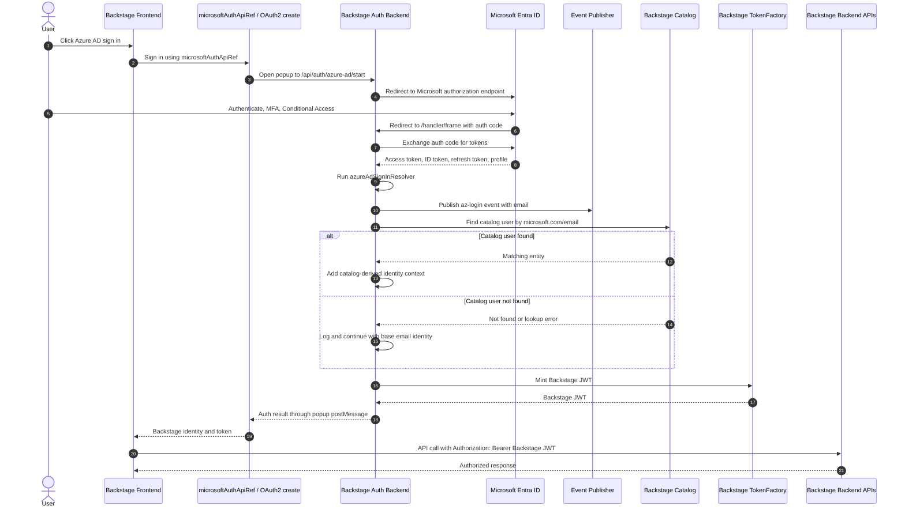
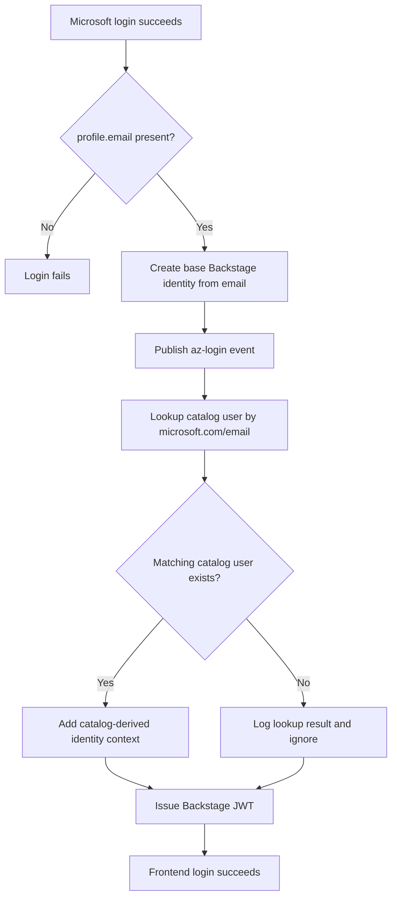
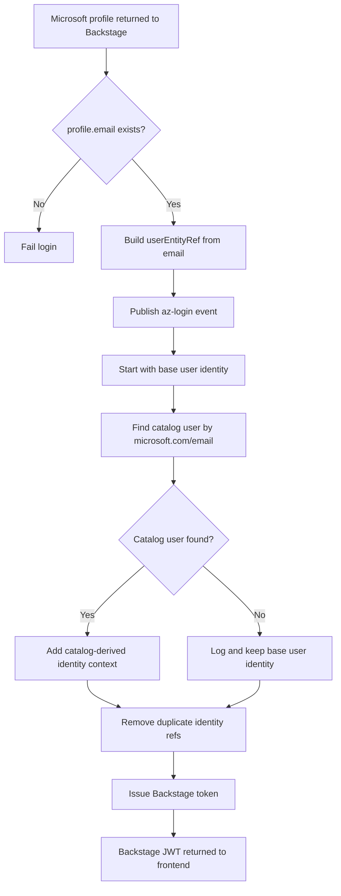
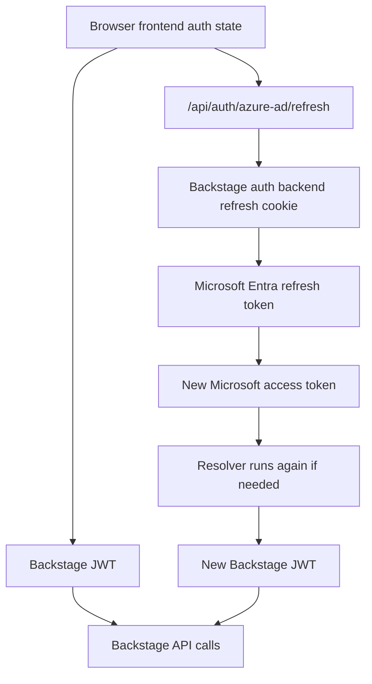
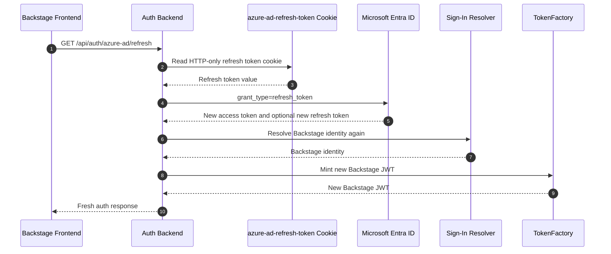
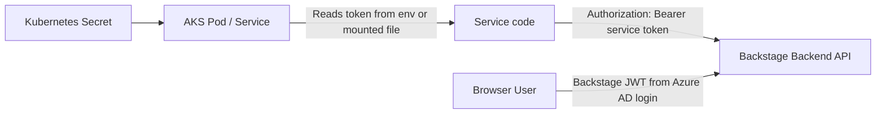

# Backstage Azure AD Authentication Flow

This document explains how Backstage login, session refresh, Backstage JWTs, and service-to-service auth fit together for an Azure AD / Microsoft Entra ID setup.

The example assumes the frontend registers a custom sign-in provider using `microsoftAuthApiRef`, and the API module implements that API with `OAuth2.create(...)` using the backend provider ID `azure-ad`.

## Short Summary

- The frontend does not directly own Microsoft login when it uses `microsoftAuthApiRef` with `OAuth2.create(...)`.
- The frontend starts a Backstage-managed OAuth popup.
- The Backstage auth backend redirects to Microsoft Entra ID and handles the OAuth callback.
- The backend resolver creates the Backstage identity used by the application.
- The backend mints the Backstage JWT used for Backstage API calls.
- Session lifetime comes from multiple places: frontend auth state, Backstage refresh cookie, Backstage JWT expiry, and Entra ID policies.
- Service-to-service tokens are separate from user login tokens and are used by backend plugins, automation, and AKS workloads.

## Frontend Wiring

The frontend normally has two pieces of wiring.

### Sign-In Provider

The sign-in page registers the visible login option:

```ts
const azureAadProvider: SignInProviderConfig = {
  id: 'azure-ad',
  apiRef: microsoftAuthApiRef,
};
```

This means: show an Azure AD / Microsoft sign-in button and use `microsoftAuthApiRef` when the user clicks it.

### Auth API Implementation

The API module registers how `microsoftAuthApiRef` works:

```ts
ApiBlueprint.make({
  params: {
    api: microsoftAuthApiRef,
    deps: { discoveryApi, oauthRequestApi, configApi },
    factory: ({ discoveryApi, oauthRequestApi, configApi }) =>
      OAuth2.create({
        discoveryApi,
        oauthRequestApi,
        configApi,
        provider: {
          id: 'azure-ad',
          title: 'Microsoft',
        },
        environment: configApi.getOptionalString('auth.environment'),
      }),
  },
});
```

This means: when `microsoftAuthApiRef` is used, call the Backstage auth backend provider named `azure-ad`.

The provider ID must match backend config:

```yaml
auth:
  providers:
    azure-ad:
      production:
        clientId: ${AZURE_CLIENT_ID}
        clientSecret: ${AZURE_CLIENT_SECRET}
        tenantId: ${AZURE_TENANT_ID}
```

## End-To-End Login Flow



## Catalog Match Branch

Your resolver does not create a catalog `User` entity during login. It creates a Backstage identity reference from the Microsoft profile email, then checks whether a matching catalog user already exists.



Meaning:

- Matching catalog user found: login succeeds with richer identity context from catalog.
- Matching catalog user not found: login still succeeds because the catch block intentionally logs/ignores the catalog lookup failure.
- No catalog `User` entity is created by this resolver.
- Missing email is different: login fails before catalog lookup.

## Step-By-Step Details

1. User opens Backstage and reaches the sign-in page.
2. The sign-in page shows the custom Azure AD provider because it was registered with `microsoftAuthApiRef`.
3. User clicks the provider.
4. `microsoftAuthApiRef` calls the `OAuth2.create(...)` implementation.
5. `OAuth2.create(...)` opens a popup to the backend route for provider `azure-ad`.
6. The Backstage auth backend redirects the popup to Microsoft Entra ID.
7. Entra ID authenticates the user, including MFA and Conditional Access if configured.
8. Entra ID redirects back to Backstage with an authorization code.
9. Backstage backend exchanges the authorization code for Microsoft tokens.
10. Backstage backend runs the custom `azureAdSignInResolver` registered through `createBackendModule(...)` for the `auth` plugin.
11. Resolver requires an email in the Microsoft profile. If email is missing, login fails.
12. Resolver creates the Backstage user identity from that email.
13. Resolver publishes an `az-login` event with the email.
14. Resolver checks the catalog for a user annotated with `microsoft.com/email: <profile.email>`.
15. If the catalog user exists, resolver adds catalog-derived identity context.
16. If the catalog user is missing, resolver logs/ignores that result and keeps the base email identity.
17. Backend signs and returns a Backstage JWT.
18. Popup sends the result back to the main frontend window.
19. Frontend uses the Backstage JWT for Backstage API calls.
20. Backend APIs verify the Backstage JWT before serving requests.

## Backend Resolver Behavior

Your backend custom module wires the Azure AD provider into the auth plugin with `createBackendModule(...)` and `createOAuthProviderFactory(...)`. The important part is the custom `azureAdSignInResolver`.

Conceptually it does this:

```ts
async function azureAdSignInResolver(profile, ctx) {
  if (!profile.email) {
    throw new Error('User profile contains no email');
  }

  const userEntityRef = stringifyEntityRef({
    kind: 'User',
    namespace: DEFAULT_NAMESPACE,
    name: profile.email,
  });

  eventPublisher.publish({
    topic: 'az-login',
    eventPayload: profile.email,
  });

  const ownershipEntityRefs = [userEntityRef];

  try {
    const entity = await ctx.findCatalogUser({
      annotations: {
        'microsoft.com/email': profile.email,
      },
    });

    ownershipEntityRefs.push(...(await ctx.resolveOwnershipEntityRefs(entity)));
  } catch (error) {
    logger.debug('Ignoring catalog lookup failure', error);
  }

  return ctx.issueToken({
    claims: {
      sub: userEntityRef,
      ent: [...new Set(ownershipEntityRefs)],
    },
  });
}
```

Actual behavior:

- `profile.email` is required. No email means no login.
- The Backstage user identity is built from the email as a `User` entity ref.
- `az-login` event is published for successful resolver execution.
- Catalog lookup uses `microsoft.com/email` annotation.
- The token starts with the user identity and then adds ownership refs resolved from the catalog entity.
- Duplicate refs are removed before token issue.

Important behavior:

- The `catch` block around catalog lookup intentionally logs/ignores the error.
- Missing catalog user does not block login.
- Login continues with only the base email-derived Backstage identity.

## What If User Is Not Present In Catalog?

This is the important branch for your implementation.

The resolver always starts by building a Backstage user identity from `profile.email`. Then it tries to enrich that identity from the catalog by looking for:

```text
microsoft.com/email: <profile.email>
```

Because your `catch` block logs/ignores the catalog lookup failure, login still succeeds.

Flow:

```text
Microsoft login succeeds
profile.email exists
userEntityRef is created from email
catalog user lookup fails or returns nothing
resolver keeps only base user identity
Backstage JWT is issued
frontend login succeeds
```

Meaning: the user can enter Backstage even if no matching catalog user exists. The token has less identity context because catalog-derived ownership data was not found.

Code shape:

```ts
try {
  const entity = await ctx.findCatalogUser({
    annotations: {
      'microsoft.com/email': profile.email,
    },
  });

  ownershipEntityRefs.push(...(await ctx.resolveOwnershipEntityRefs(entity)));
} catch (error) {
  logger.debug('Ignoring catalog lookup failure', error);
}
```

If this catch did not ignore the error, a missing catalog user would block login because the resolver would not reach token issue.

## Backend Resolver Diagram



## Implementation Risks To Verify

- `name: profile.email` may be risky if your Backstage entity naming rules do not allow full email values with `@` and dots. Safer pattern is usually to use the actual catalog entity ref when a catalog entity is found.
- The token subject is always the email-derived ref in the described code. If catalog user metadata name differs from email, token subject and catalog entity can diverge.
- Email can change. Immutable Microsoft IDs are usually more stable for long-term identity mapping.
- Publishing `az-login` before token issue means event consumers may see login events even if later catalog resolution or token issue fails.
- Because catalog lookup failure is ignored, users without catalog identity context still receive a token. That is intentional in your code.

## Session Layers

There is no single session. There are several layers.



### 1. Browser Frontend Auth State

The frontend stores the current auth result through Backstage auth APIs.

Used by:

- `microsoftAuthApiRef.getBackstageIdentity()`
- `microsoftAuthApiRef.getAccessToken()`
- `fetchApiRef` attaching Backstage tokens to API calls

This is client-side state. It is not the main security boundary.

### 2. Backstage Auth Backend Refresh Cookie

After successful login, the backend stores provider refresh state in an HTTP-only cookie.

For Azure AD provider, the cookie is commonly provider-specific, for example:

```text
azure-ad-refresh-token
```

Purpose:

```text
Let /refresh obtain fresh Microsoft tokens and mint a fresh Backstage JWT without showing login popup again.
```

Important properties:

- HTTP-only, so frontend JavaScript cannot read it.
- Sent automatically by browser to matching Backstage auth backend routes.
- Max age is controlled by provider `sessionDuration`.
- Real usability still depends on Microsoft refresh token validity and Conditional Access.

Example:

```yaml
auth:
  providers:
    azure-ad:
      production:
        sessionDuration:
          hours: 1
```

### 3. Backstage JWT

The Backstage JWT is minted by the Backstage backend and used for Backstage API calls.

```http
Authorization: Bearer <backstage-jwt>
```

Default lifetime is commonly 1 hour.

This setting controls API token lifetime:

```yaml
auth:
  backstageTokenExpiration: 3600
```

This does not fully control user session lifetime because the frontend can call `/refresh` and receive a new Backstage JWT while the refresh cookie and Entra session are still valid.

### 4. Microsoft Entra ID Session And Refresh Token

Microsoft controls:

- Entra browser login session.
- Entra access token lifetime, often around 1 hour.
- Entra refresh token lifetime.
- Conditional Access sign-in frequency.
- MFA requirements.

For a strict 60-minute user session, configure both:

```yaml
auth:
  providers:
    azure-ad:
      production:
        sessionDuration:
          hours: 1
```

And Microsoft Entra Conditional Access:

```text
Sign-in frequency: 1 hour
```

Setting only Backstage JWT expiry to 1 hour is not enough because silent refresh can mint a new JWT.

## Refresh Flow



## Backstage JWT Vs Microsoft Tokens

| Token | Issuer | Used For | Main Consumer |
| --- | --- | --- | --- |
| Microsoft access token | Microsoft Entra ID | Microsoft APIs such as Graph | Backend or frontend plugin requesting Microsoft resources |
| Microsoft refresh token | Microsoft Entra ID | Getting new Microsoft access tokens | Backstage auth backend through HTTP-only cookie |
| Backstage JWT | Backstage auth backend | Backstage API calls | Backstage frontend and backend plugins |
| Kubernetes Secret service token | Kubernetes Secret injected into runtime | Backend plugin, automation, or workload auth | Backend services, AKS workloads, scripts |

## Service-To-Service Auth With Kubernetes Secret

Service-to-service auth is separate from browser login. In your setup, the service credential is stored as a Kubernetes Secret and injected into the pod at runtime.

User login token answers:

```text
Which human user logged in through Azure AD?
```

Kubernetes Secret service token answers:

```text
Which internal service or workload is calling this backend?
```

Typical shape:

```text
Kubernetes Secret stores service token
Pod receives token as environment variable or mounted file
Service reads token at startup/request time
Service sends token in Authorization header
Receiving backend validates token against its configured secret/token value
```

Example request:

```http
Authorization: Bearer <token-from-kubernetes-secret>
```

This token is not created by Azure AD login and is not the Backstage user JWT. It is a machine credential used when no browser user is involved.

Common examples:

- AKS workload calling a Backstage backend endpoint.
- Internal service calling a Backstage plugin API.
- Scheduled job or automation calling Backstage.
- Backend component calling another backend endpoint without a human user session.



Operational notes:

- Store the token only in Kubernetes Secret, not in source code.
- Rotate the secret on a known schedule and after suspected exposure.
- Limit which namespaces, pods, and service accounts can read the secret.
- Use separate secrets per service when possible, rather than one shared token everywhere.
- Treat logs carefully; never print the token.
- User JWT and service token may both be Bearer tokens, but they represent different callers.

## What Would Be Different With Direct MSAL Browser Login?

Your current flow is Backstage-managed OAuth. It is not direct MSAL browser ownership.

Direct MSAL browser login would look like this:

```ts
const msal = new PublicClientApplication(msalConfig);
await msal.loginPopup();
await msal.acquireTokenSilent({ scopes: ['User.Read'] });
```

That changes ownership:

- Browser directly talks to Microsoft identity platform.
- MSAL caches Microsoft account and tokens in browser storage.
- Backstage backend does not automatically mint a Backstage JWT.
- A custom bridge is needed if Backstage still needs its own identity and Backstage JWT.

Your `microsoftAuthApiRef` plus `OAuth2.create(...)` flow keeps the auth backend in control of token exchange, resolver execution, refresh cookie, and Backstage JWT minting.

## Practical Debug Checklist

Use this checklist when debugging login or session issues.

| Symptom | Check |
| --- | --- |
| Login button appears but popup fails | Frontend provider `apiRef`, provider ID, backend route, popup blockers |
| Entra login works but Backstage denies access | Sign-in resolver, provider ID, backend auth config |
| User remains logged in longer than expected | `sessionDuration`, Entra Conditional Access sign-in frequency, refresh cookie max age |
| JWT expires but user is silently logged back in | Expected if `/refresh` succeeds |
| API call gets 401 | Backstage JWT missing, expired, invalid issuer/key, frontend not using `fetchApiRef` |
| Service call gets 401 | Kubernetes Secret not mounted, wrong env var/file path, token mismatch, receiving backend not configured with same secret |

## Recommended Production Shape

```text
Backstage provider sessionDuration matches business session requirement
Entra Conditional Access enforces actual reauthentication requirement
Service-to-service auth stays separate from user login
```

This shape is stricter, easier to audit, and keeps user login separate from machine-to-machine access.
