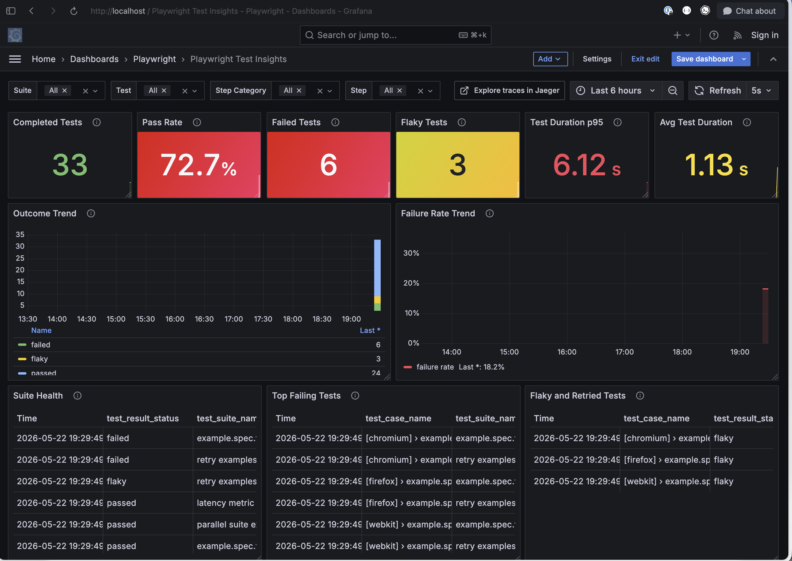
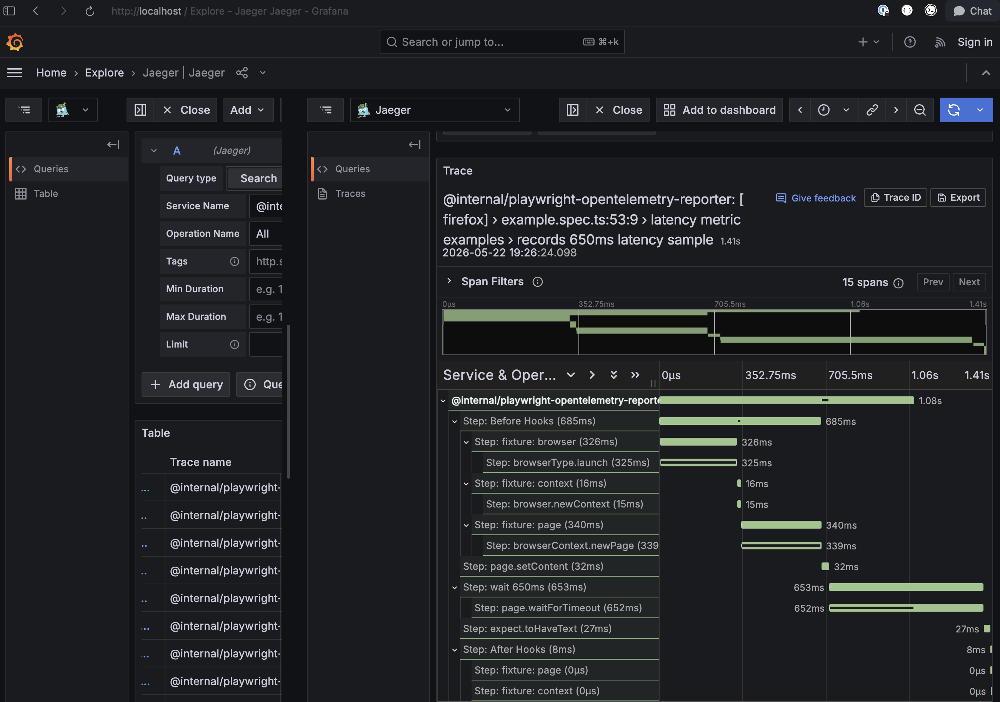

# Playwright OpenTelemetry Reporter

Simple reporter that generates OpenTelemetry traces and metrics from Playwright test runs. You can then export this
telemetry to your vendor of choice.





## Runtime Requirements

This internal package supports Node 22.x and Node 24.x:

```json
{
  "engines": {
    "node": ">=22 <23 || >=24 <25"
  }
}
```

Older Node versions are intentionally unsupported so the development, test, and security tooling can stay on maintained
runtime baselines.

## Dependency Security

The published runtime dependency set is intentionally small. Most dependency risk lives in local development, CI,
documentation, coverage, and release tooling.

Use these commands when validating dependency and behavior changes:

```sh
npm install
npm audit --omit=dev
npm audit
npm run build
npm run test:unit
npm run test:lint
npm run test:prettier
npm run playwright -- --project=chromium
npm run otel:verify
```

GitLab is the target CI and publishing environment for this package. GitHub-specific coverage and release tooling is not
required unless a future GitLab workflow explicitly reintroduces an equivalent step.

## Installation

### Dependencies

Install the package with your favorite package manager:

```
$ npm install @internal/playwright-opentelemetry-reporter --save-dev
```

You will also need to install the OpenTelemetry Node SDK and any other packages required by your vendor to export traces
and metrics.

```
$ npm install @opentelemetry/sdk-node --save-dev
```

### Initialize the SDK

To collect telemetry, you must initialize the OpenTelemetry SDK before Playwright begins running your tests. The easiest
way to do this is through `globalSetup`. For example:

```ts
// global-setup.ts
import { OTLPMetricExporter } from '@opentelemetry/exporter-metrics-otlp-http';
import { OTLPTraceExporter } from '@opentelemetry/exporter-trace-otlp-http';
import { Resource } from '@opentelemetry/resources';
import { PeriodicExportingMetricReader } from '@opentelemetry/sdk-metrics';
import { NodeSDK } from '@opentelemetry/sdk-node';
import {
  ATTR_SERVICE_NAME,
  ATTR_SERVICE_VERSION,
} from '@opentelemetry/semantic-conventions';
import { FullConfig } from '@playwright/test';
import {
  name as PKG_NAME,
  version as PKG_VERSION,
} from '@internal/playwright-opentelemetry-reporter';

const sdk = new NodeSDK({
  resource: new Resource({
    [ATTR_SERVICE_NAME]: PKG_NAME,
    [ATTR_SERVICE_VERSION]: PKG_VERSION,
  }),
  traceExporter: new OTLPTraceExporter(),
  metricReader: new PeriodicExportingMetricReader({
    exporter: new OTLPMetricExporter(),
  }),
});

export default async function globalSetup(_config: FullConfig) {
  sdk.start();

  return async () => {
    await sdk.shutdown();
  };
}
```

N.b. ensure your `globalSetup` functions returns a function that calls `sdk.shutdown()`. This will ensure that traces
and metrics are exported before Playwright exits.

### Configure Playwright

Configure Playwright to use your `global-setup.ts` and the reporter:

```ts
// playwright.config.ts
export default defineConfig({
  globalSetup: require.resolve('./global-setup.ts'),
  reporter: '@internal/playwright-opentelemetry-reporter',
});
```

### Local Visualization

For local visualization, this repo includes a Docker Compose stack with OpenTelemetry Collector, Prometheus, Jaeger,
and Grafana.

Start the stack:

```sh
npm run otel:up
```

Build the reporter and run Playwright:

```sh
npm run build
npm run playwright
```

Open the pre-provisioned Grafana dashboard:

```text
http://localhost:3000/d/playwright-otel/playwright-opentelemetry
```

For full setup, verification queries, trace checks, and troubleshooting, see
[Local Observability Quick Start](QUICK_START_LOCAL_OTEL.md).

For a quick telemetry smoke test that does not launch a browser:

```sh
npm run build
npm run otel:verify
```

Stop the stack with:

```sh
npm run otel:down
```

## Usage

### Generated Spans

This reporter generates spans for each test case and for each test step within each test case. Step spans are nested
according to Playwright's internal organization. Practically, this means that work in before and after hooks will be
grouped under nested spans, as will work to set up fixtures, etc.

### Span Statuses

The reporter will set status on test spans and step spans according to the status of each test or step.

For step spans, if an error occurs during the step (e.g. a locator times out, or a click fails), the span's status will
be set to `ERROR` and the error message will be recorded on the span.

For test spans, the span will only be set to `ERROR` if the test fails _unexpectedly_. Tests which are skipped or which
pass will be `UNSET`. Similarly, expected errors (e.g. declared with `test.fail`) will also be `UNSET`.

### Generated Metrics

Metrics are enabled by default. The reporter records metrics through the global OpenTelemetry meter provider configured
by your SDK setup.

The current metric names are:

| Metric               | Type      | Description                                         |
| -------------------- | --------- | --------------------------------------------------- |
| `test.duration`      | Histogram | Test execution duration in milliseconds             |
| `test.count`         | Counter   | Number of completed tests, grouped by result status |
| `test.step.duration` | Histogram | Test step duration in milliseconds                  |

Common metric attributes include:

| Attribute            | Description                                                |
| -------------------- | ---------------------------------------------------------- |
| `test.case.name`     | Formatted Playwright test name                             |
| `test.result.status` | `passed`, `failed`, `flaky`, or `skipped`                  |
| `test.retry.count`   | Playwright retry attempt count                             |
| `test.step.name`     | Playwright step title                                      |
| `test.step.category` | Playwright step category, for example `pw:api` or `expect` |

#### Adding Custom Attributes to Metrics

You can add run-level attributes to every metric, which is useful for CI metadata such as branch, commit SHA, and pipeline ID. These attributes are automatically included on all test duration, test count, and step duration metrics.

**Basic Example:**

```ts
// playwright.config.ts
export default defineConfig({
  reporter: [
    [
      '@internal/playwright-opentelemetry-reporter',
      {
        metrics: {
          attributes: {
            'git.branch': process.env.CI_COMMIT_REF_NAME || 'local',
            'git.commit.sha': process.env.CI_COMMIT_SHA || 'unknown',
          },
        },
      },
    ],
  ],
});
```

**CI Environment Example (GitLab CI):**

```ts
// playwright.config.ts
export default defineConfig({
  reporter: [
    [
      '@internal/playwright-opentelemetry-reporter',
      {
        metrics: {
          attributes: {
            'git.branch': process.env.CI_COMMIT_REF_NAME || 'local',
            'git.commit.sha': process.env.CI_COMMIT_SHA || 'unknown',
            'git.repository': process.env.CI_PROJECT_PATH,
            'pipeline.id': process.env.CI_PIPELINE_ID,
            'pipeline.run_number': process.env.CI_PIPELINE_IID,
            environment: process.env.CI_ENVIRONMENT_NAME || 'development',
          },
        },
      },
    ],
  ],
});
```

**How Custom Attributes Flow:**

1. Attributes defined in `metrics.attributes` are passed to the `MetricsCollector` at reporter initialization
2. When a metric is recorded (test ends, step ends), attributes are merged in this order:
   - Global attributes from `metrics.attributes` (CI metadata, branch, etc.)
   - Test-level attributes from Playwright annotations
   - Metric-specific attributes (test name, step name, status, retry count, suite name)
3. All merged attributes are sent with every metric to your OpenTelemetry backend

````

Metrics also support the same annotation prefix used by trace spans. Any annotation created with `annotationLabel()` is
added to that test's metric attributes:

```ts
import { annotationLabel } from '@internal/playwright-opentelemetry-reporter';

test("example test", async ({ page }) => {
  test.info().annotations.push({
    type: annotationLabel("owner"),
    description: "checkout",
  });

  // ...
});
````

#### Disabling Metrics

Metrics are enabled by default. You can disable metrics collection while keeping distributed tracing enabled if you only want to collect traces.

**Option 1: Disable metrics completely**

```ts
// playwright.config.ts
export default defineConfig({
  reporter: [
    [
      '@internal/playwright-opentelemetry-reporter',
      {
        metrics: false, // ← Metrics disabled, traces still enabled
      },
    ],
  ],
});
```

**Option 2: Disable metrics using enabled flag**

```ts
// playwright.config.ts
export default defineConfig({
  reporter: [
    [
      '@internal/playwright-opentelemetry-reporter',
      {
        metrics: {
          enabled: false, // ← Metrics disabled, traces still enabled
        },
      },
    ],
  ],
});
```

**What Happens When Metrics Are Disabled:**

- ✅ Distributed tracing still works (test spans and step spans are created)
- ✅ OpenTelemetry SDK still exports traces to your backend
- ✅ No histogram/counter metrics are recorded or exported
- ✅ No performance overhead from metrics collection
- ✅ You save on data storage and ingestion costs

**Default Behavior (Metrics Enabled):**

```ts
// playwright.config.ts
export default defineConfig({
  reporter: [
    [
      '@internal/playwright-opentelemetry-reporter',
      {
        // metrics: {}, // Use default - metrics enabled
        // OR explicitly enable:
        // metrics: { enabled: true }
      },
    ],
  ],
});
```

When enabled (default), the reporter collects:

- Test duration (histogram)
- Test count (counter, grouped by result status)
- Test step duration (histogram)
- All metrics include attributes for filtering and grouping

#### Adding Custom Attributes to Traces

You can configure run-level attributes for trace spans too, using the same reporter-level pattern as metrics. This is useful for CI metadata such as branch, commit SHA, and pipeline ID.

Trace attributes live under `traces.attributes` and use the `TraceAttributes` shape, which mirrors the metrics attribute pattern but keeps the intent clear.

**Basic Example:**

```ts
// playwright.config.ts
export default defineConfig({
  reporter: [
    [
      '@internal/playwright-opentelemetry-reporter',
      {
        traces: {
          attributes: {
            'git.branch': process.env.CI_COMMIT_REF_NAME || 'local',
            'git.commit.sha': process.env.CI_COMMIT_SHA || 'unknown',
          },
        },
      },
    ],
  ],
});
```

**CI Environment Example (GitLab CI):**

```ts
// playwright.config.ts
export default defineConfig({
  reporter: [
    [
      '@internal/playwright-opentelemetry-reporter',
      {
        traces: {
          enabled: true,
          attributes: {
            'git.branch': process.env.CI_COMMIT_REF_NAME || 'local',
            'git.commit.sha': process.env.CI_COMMIT_SHA || 'unknown',
            'git.repository': process.env.CI_PROJECT_PATH,
            'pipeline.id': process.env.CI_PIPELINE_ID,
            'pipeline.run_number': process.env.CI_PIPELINE_IID,
            environment: process.env.CI_ENVIRONMENT_NAME || 'development',
          },
        },
      },
    ],
  ],
});
```

**Trace Configuration Reference**

| Option       | Type              | Default | Description                                                                                                                 |
| ------------ | ----------------- | ------- | --------------------------------------------------------------------------------------------------------------------------- |
| `enabled`    | boolean           | `true`  | Enable/disable trace span creation from the reporter. When disabled, the reporter still runs metrics if metrics are enabled |
| `attributes` | `TraceAttributes` | `{}`    | Key-value pairs of custom attributes added to all test and step spans                                                       |

When enabled, trace attributes are merged onto test spans and step spans alongside the built-in span fields the reporter already sets. This is the trace-side sibling of `metrics.attributes`.

**Attribute Merging Order:**

Attributes are merged in this order (later layers override earlier):

1. **Global attributes** - from `traces.attributes` (CI metadata)
2. **Test-level attributes** - from Playwright test annotations
3. **Trace-specific attributes** - built-in span fields such as test title, step title, status, retry count, and suite name

#### Metrics Configuration Reference

Here's a complete reference of all metrics configuration options:

```ts
// playwright.config.ts
export default defineConfig({
  reporter: [
    [
      '@internal/playwright-opentelemetry-reporter',
      {
        metrics: {
          // Enable or disable metrics collection
          // Default: enabled
          enabled: true,

          // Add custom attributes to all metrics
          // Useful for CI metadata (branch, commit, pipeline ID, etc.)
          attributes: {
            'git.branch': process.env.CI_COMMIT_REF_NAME,
            'git.commit.sha': process.env.CI_COMMIT_SHA,
            'pipeline.id': process.env.CI_PIPELINE_ID,
            environment: process.env.CI_ENVIRONMENT_NAME,
          },

          // Use a custom metrics exporter
          // If not provided, uses OpenTelemetryMetricsExporter (recommended)
          exporter: new MyCustomMetricsExporter(),
        },
      },
    ],
  ],
});
```

**Configuration Options:**

| Option       | Type            | Default                        | Description                                                                                                      |
| ------------ | --------------- | ------------------------------ | ---------------------------------------------------------------------------------------------------------------- |
| `enabled`    | boolean         | `true`                         | Enable/disable metrics collection. When disabled, only traces are exported                                       |
| `attributes` | object          | `{}`                           | Key-value pairs of custom attributes added to all metrics. Merged with test-level and metric-specific attributes |
| `exporter`   | MetricsExporter | `OpenTelemetryMetricsExporter` | Custom exporter for sending metrics to non-OTEL backends                                                         |

**Attribute Merging Order:**

Attributes are merged in this order (later layers override earlier):

1. **Global attributes** - from `metrics.attributes` (CI metadata)
2. **Test-level attributes** - from Playwright test annotations
3. **Metric-specific attributes** - `test.case.name`, `test.result.status`, `test.retry.count`, `test.suite.name`, `test.step.name`, `test.step.category`

You can also inject a custom metrics exporter for tests or custom backends:

```ts
import {
  Metric,
  MetricsExporter,
} from '@internal/playwright-opentelemetry-reporter';

class CustomMetricsExporter implements MetricsExporter {
  send(metric: Metric): void {
    // Send metric to your backend.
  }
}

export default defineConfig({
  reporter: [
    [
      '@internal/playwright-opentelemetry-reporter',
      {
        metrics: {
          exporter: new CustomMetricsExporter(),
        },
      },
    ],
  ],
});
```

### Attaching Span Attributes

You can attach attributes to the test span by using Playwright
[test annotations](https://playwright.dev/docs/test-annotations). Your annotation `type` must start with the prefix
`pw_otel_reporter.` in order to be attached to the span. Anything after the prefix will be used as the attribute name,
and the description will be used as the attribute value.

To make constructing the `type` easier, you can use the `annotationLabel` function.

```ts
import { annotationLabel } from '@internal/playwright-opentelemetry-reporter';

test('example test', async ({ page }) => {
  // ...
  test.info().annotations.push({
    type: annotationLabel('my_annotation'),
    description: 'My custom annotation!',
  });
});
```

## License

Apache-2.0.

This package includes code derived from the MIT-licensed `@aergonaut/playwright-opentelemetry-reporter` project. See
`NOTICE.md` and `THIRD_PARTY_NOTICES.md` for attribution and upstream license details.
